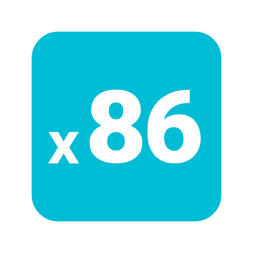
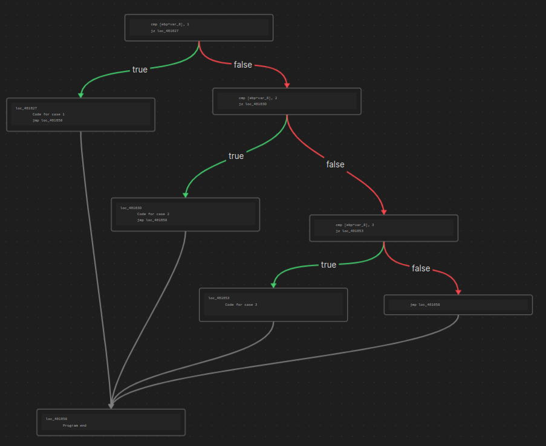

# Obsidian X86 Flow Graph



## What is this?

This is a plugin for [Obsidian](https://obsidian.md) that converts x86 assembly into a flow diagram using Obsidian Canvases

## Usage

This plugin adds a command called `x86-create-flow-diagram`. To use this plugin you must highlight a valid x86 code block (without the \`\`\` at the start and end) and run the command.

This plugin requires a specific format for the assembly in order to properly generate nodes and edges for the flow graph.

The key format features are as a follows:
  
  1. All instructions must be indeneted
  2. Location for jumps must have no spaces before the location name
  3. jmp instruction must be used for unconditional jumps (1 branch)
  4. any other instruction beginning with a j is treated as a conditional jump (2 branches)
  5. all jump instructions must take only 1 argument and that must be the location name (jmp location1)

This is an example of a valid x86 code block for use with this plugin

```x86
	cmp [ebp+var_8], 1
	jz loc_401027
	cmp [ebp+var_8], 2
	jz loc_40103D
	cmp [ebp+var_8], 3
	jz loc_401053
	jmp loc_401058
loc_401027
	Code for case 1
	jmp loc_401058
loc_40103D
	Code for case 2
	jmp loc_401058
loc_401053
	Code for case 3
loc_401058
	Program end
```

running `x86-create-flow-diagram` on the above codeblock would result in the following graph being produced in the same directory as the current note:



It won't look as nice as this at first, all of the blocks will be mixed up and you'll have to drag them around to make it look pretty. I'm working on doing this a little better...

### Plugin in practice

https://user-images.githubusercontent.com/43447026/216844597-0f27621c-f269-47f4-a5e0-7084a5444184.mp4

## Roadmap

### TODO:
- [x] Add true/false labels to edges
- [x] Handle \`\`\` characters on both sides of selected text
- [x] Move nodes to left or right to increase readbility (kinda)
- [ ] Insert Link to graph below codeblock
- [ ] Test, test, test...
---

I'm on buy meacoffee!
<div align="center">
  <a href="https://www.buymeacoffee.com/djwolfe">
    
  </a>
</div>
